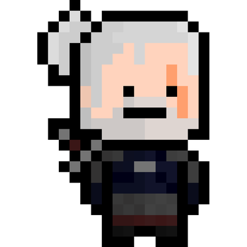
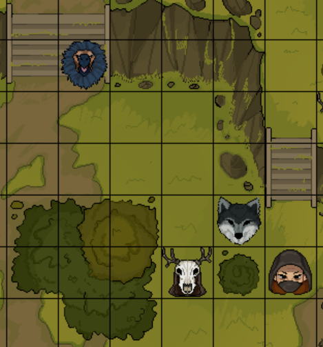

# WIEDZMAK 

    
Spis tresci

    <ol>
        <li>
            <a href="#o-projekcie">O projekcie</a>
        </li>
        <li>
            <a href="#uzyte-technologie">Uzyte technologie</a>
        </li>
        <li>
            <a href=#uzyte-algorytmy">Uzyte algorytmy</a>
        </li>
        <li>
            <a href="#zespol">Zespol</a>
        </li>
    </ol>

<!-- O PROJEKCIE -->

### O projekcie

Wiedźmak porusza się po planszy 2D, na której znajdują się różni przeciwnicy. Musi znaleźć optymalną drogę do przeciwnika, określić jego rodzaj oraz dobrać odpowiedni miecz oraz olej do walki. Po wygranej (dobrym dobraniu ekwipunku) wiedźmaka przeciwnik jest pokonany i znika z planszy, natomiast jeśli ekwipunek był nieodpowiedni wiedźmak przegrywa walke (umiera). Celem wiedźmaka jest pokonanie wszystkich stworów na planszy w jednym podejściu.

<!-- UZYTE TECHNOLOGIE -->

### Uzyte technologie

- Python
- PyGame

### Uzyte algorytmy

- Drzewa decyzyjne
- Sieci neuronowe
    - Zdjęcia Leshego (autor: Dominika Lesniewska): https://drive.google.com/drive/folders/1R5TlFmwyJl8MG4hWFTVmTvZej_wGButY
    - Zdjęcia Wilka (autor: Alicja Szulecka): https://drive.google.com/drive/folders/179K8Mp8_3NGVhpybZnue78cB1e6B80VW?usp=sharing
    - Zdjęcia Gryfa (autor: Dominik Mikołajczyk): https://drive.google.com/drive/folders/1059oIe5fiTES7k2KDk0XL1buBgvOQ7zh?usp=sharing
    - Zdjęcia Bandyty (autor: Karol Filipiak): https://drive.google.com/drive/folders/1p_gDXpxJ6Wt5XboH4mMr7H8U4RVHqIdY
    - Model Sieci: https://drive.google.com/drive/folders/15nrdaRUqK2VCjWd-sJhzEProEEI_DlJZ?usp=sharing
- Algorytmy genetyczne
- A\* Pathfinder

<!-- ZESPOL -->

### Zespol

- Arden Wolowiec
- Alicja Szulecka
- Karol Filipiak
- Dominik Mikolajczyk
- Dominika Lesniewska
